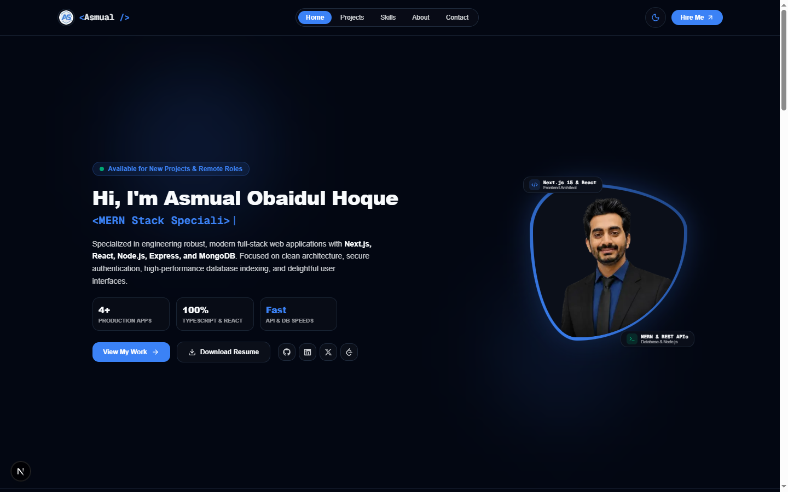
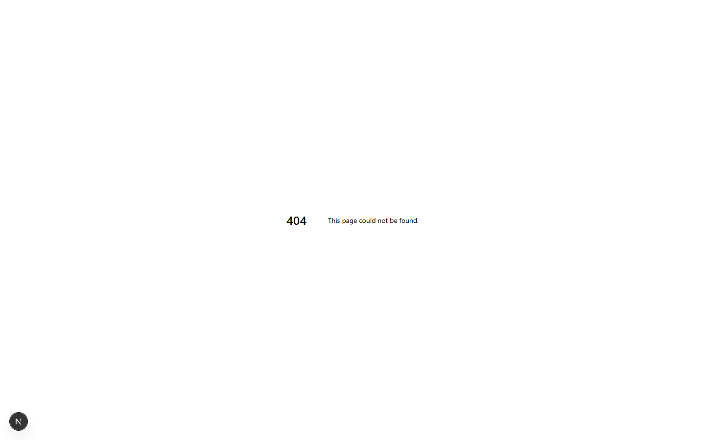

# 🌟 Asmual-Portfolio-ts — Modern Full-Stack Developer Portfolio

<div align="center">

  [](https://nextjs.org/)
  [](https://react.dev/)
  [](https://www.typescriptlang.org/)
  [](https://tailwindcss.com/)
  [](https://www.framer.com/motion/)
  [](https://resend.com/)

  <p align="center">
    <strong>Asmual-Portfolio-ts</strong> is a modern, high-performance personal developer portfolio engineered with <strong>Next.js 16 (App Router)</strong>, <strong>React 19</strong>, <strong>TypeScript 5</strong>, <strong>Tailwind CSS v4</strong>, <strong>Framer Motion 12</strong>, and <strong>Lenis Smooth Scroll</strong>.
  </p>

  <p align="center">
    <a href="https://github.com/Asmual/Asmual-Portfolio.ts"><strong>View GitHub Repository »</strong></a>
    <br />
    <br />
    <a href="#-portfolio-visual-previews">Screenshots</a> •
    <a href="#-architecture--tech-stack">Tech Stack</a> •
    <a href="#-key-ui--animation-features">UI & Animations</a> •
    <a href="#-folder-structure">Folder Structure</a> •
    <a href="#-getting-started">Installation</a> •
    <a href="#-author--connect">Connect</a>
  </p>
</div>

---

## 📸 Portfolio Visual Previews

### 🌟 1. Homepage & Hero Section

*Featuring the organic curved developer avatar frame, live status pulse, floating tech chips (`<Next.js 15 & React />`, `<MERN & REST APIs />`), dynamic typewriter roles, and metrics ribbon.*

<br />

### 💼 2. Projects & Showcase Hub

*Interactive project ecosystem featuring category filter tabs (`All`, `Full Stack`, `MERN`, `Frontend`, `Backend`), instant keyword search, pause-on-hover carousel slider, and expandable feature highlights.*

---

## 🚀 Key UI & Animation Features

- **⚡ Futuristic Glassmorphic Page Loader**:
  - Central frosted glass card with an ambient glowing backdrop.
  - Infinite 360° rotating neon dashed ring surrounding a glowing code icon.
  - Dynamic real-time boot sequence steps (`Bootstrapping application...`, `Loading interactive modules...`, etc.).
  - Glowing dual-gradient progress bar with custom curtain slide-up (`y: "-100%"`) exit animation.

- **🎯 Fluid Custom Cursor & Compact Halo**:
  - Compact 24px trailing halo ring with a center accent dot powered by Framer Motion spring physics.
  - Non-blocking `pointer-events-none` architecture and automatic touch-screen bypass.

- **👨‍💻 Modern Hero Section & Identity**:
  - Live availability badge (`Available for New Projects & Remote Roles`).
  - Organic curved avatar border (`rounded-[30%_70%_70%_30%/30%_30%_70%_70%]`) with ambient lighting.
  - Interactive floating chips for `<Next.js 15 & React />` and `<MERN & REST APIs />`.
  - Typewriter effect cycling dynamically through specialized developer roles.
  - Metrics strip displaying production applications count (`4+ Production Apps`).

- **🗂️ Centralized Project Showcase**:
  - Fully typed project repository stored in `src/data/projects.ts`.
  - Filter pills for `All`, `Full Stack`, `MERN`, `Frontend`, and `Backend`.
  - Auto-sliding image carousel that pauses on mouse hover.
  - Expandable "Key Highlights" toggle drawer and direct GitHub repository / live demo links.

- **🛠️ Modular 3-Column Skills Matrix**:
  - Clean, modern layout dividing skills into **Frontend Engineering**, **Backend & Databases**, and **Tools & Cloud**.
  - Authentic brand icons, proficiency level indicators, and responsive grid alignment.

- **📍 Real-Time ScrollSpy & Floating Back-To-Top**:
  - Sticky navbar dynamically tracks viewport scroll position and slides active pill indicator to current section.
  - Floating `↑ TOP` quick-jump button appears smoothly past the Hero section.

- **📬 Contact Hub & Direct Resend Email Integration**:
  - Quick preset subject buttons (`Project Inquiry`, `Full-time Role`, `Freelance Work`, `General Consultation`).
  - One-click copy email button with instant feedback tooltip.
  - Next.js API route (`/api/contact`) sending inquiries directly via Resend API.

- **🎨 Multi-Theme System**:
  - Seamless switching across **Light**, **Dark**, and **Gray** theme modes using CSS custom properties and Tailwind CSS v4.

---

## 🛠️ Architecture & Tech Stack

### **Core Framework & Runtime**
- **Framework**: [Next.js 16](https://nextjs.org/) (App Router, Server & Client Components)
- **UI Library**: [React 19](https://react.dev/) (React 19 Compiler support)
- **Language**: [TypeScript 5](https://www.typescriptlang.org/) (Strict mode, end-to-end type safety)

### **Styling, Design System & Icons**
- **CSS Engine**: [Tailwind CSS v4](https://tailwindcss.com/) with `@theme` token definitions
- **Typography**: Geist Sans & Geist Mono
- **Icon Packages**: [Lucide React](https://lucide.dev/) & [React Icons](https://react-icons.github.io/react-icons/) (`fa6`, `si`)

### **Animations & Motion Physics**
- **Motion Engine**: [Framer Motion 12](https://www.framer.com/motion/) (`layout`, `AnimatePresence`, spring physics)
- **Smooth Scroll**: [Lenis](https://lenis.darkroom.engineering/) (`@studio-freight/lenis`)

### **Backend, Database & Services**
- **Email Delivery**: [Resend API](https://resend.com/) (`/api/contact`)
- **Database**: [MongoDB](https://www.mongodb.com/) & Mongoose (Adapter support)
- **Authentication**: Better-Auth (`@better-auth/mongo-adapter`)
- **Notifications**: React Hot Toast

---

## 📂 Folder Structure

```text
Asmual-Portfolio.ts/
├── public/
│   ├── images/
│   │   ├── arthub/            # ArtHub project preview assets
│   │   ├── docappint/         # DocAppoint project preview assets
│   │   ├── mykeeps/           # My Keeps project preview assets
│   │   ├── suncart/           # SunCart project preview assets
│   │   ├── preview/           # Actual portfolio screenshot previews
│   │   ├── asmual.png         # Developer profile photo
│   │   └── as_logo.png        # Brand avatar & logo
│   └── resume/                # PDF developer resume
├── src/
│   ├── app/
│   │   ├── (routes)/          # Standalone pages (/about, /projects, /skills, /contact)
│   │   ├── api/
│   │   │   └── contact/       # Next.js API route handling Resend email delivery
│   │   ├── globals.css        # Tailwind v4 theme definitions, color-mix & variables
│   │   ├── layout.tsx         # Root layout mounting cursor, loader, scroll & back-to-top
│   │   └── page.tsx           # Portfolio landing page assembling all core sections
│   ├── components/
│   │   ├── layout/            # Layout components (Navbar, Footer, ScrollSpy)
│   │   ├── providers/         # Providers (Lenis SmoothScroll wrapper)
│   │   ├── sections/          # Main sections (Hero, About, Skills, Projects, Contact)
│   │   └── ui/                # UI components (CustomCursor, BackToTop, PageLoader, ThemeToggle)
│   ├── data/
│   │   ├── projects.ts        # Centralized TypeScript data store for projects
│   │   └── skills.ts          # Centralized skills catalog
│   └── types/
│       └── index.ts           # Global TypeScript type definitions
├── package.json               # Dependencies and build scripts
├── tsconfig.json              # TypeScript configuration
└── README.md                  # Comprehensive documentation
```

---

## 🚀 Getting Started

### Prerequisites
Make sure you have **Node.js 18.x or higher** installed on your system.

### 1. Clone the Repository
```bash
git clone https://github.com/Asmual/Asmual-Portfolio.ts.git
cd Asmual-Portfolio.ts
```

### 2. Install Dependencies
```bash
npm install
# or
yarn install
# or
pnpm install
```

### 3. Environment Variables Configuration
Create a `.env.local` file in the root directory and add the following keys:

```env
# Resend API Key for Contact Form
RESEND_API_KEY=your_resend_api_key_here
CONTACT_EMAIL=asmualobaidulhoque@gmail.com

# Optional MongoDB / Auth configuration
MONGODB_URI=your_mongodb_connection_string
BETTER_AUTH_SECRET=your_auth_secret_key
BETTER_AUTH_URL=http://localhost:3000
```

### 4. Run Development Server
```bash
npm run dev
```

Open [http://localhost:3000](http://localhost:3000) in your browser.

### 5. Build for Production
```bash
npm run build
npm run start
```

---

## 🌐 Featured Projects Showcased

1. **[My Keeps](https://my-keeps-pink.vercel.app)** — Smart Cloud Workspace & Note Manager *(Next.js 16, React 19, TypeScript, Express.js 5, MongoDB, Cloudinary, Better-Auth)*
2. **[ArtHub](https://arthub-three.vercel.app)** — Online Art Marketplace *(Next.js 15, React, Tailwind CSS, MongoDB, Express.js, Stripe)*
3. **[Asmual Portfolio (JavaScript Edition)](https://asmual-portfolio.vercel.app)** — Interactive Developer Portfolio *(Next.js, React 19, JavaScript, DaisyUI, Tailwind CSS, Framer Motion)*
4. **[DocAppoint](https://docappoint-eight-drab.vercel.app)** — Doctor Appointment Booking System *(Next.js, TypeScript, Tailwind CSS, Express.js, MongoDB)*
5. **[SunCart](https://suncart-woad-three.vercel.app/)** — E-Commerce Management Platform *(React, Node.js, Express.js, MongoDB, Tailwind CSS)*

---

## 📬 Author & Connect

<div align="center">
  <h3>Asmual Obaidul Hoque</h3>
  <p><strong>Full-Stack Web Developer • MERN & Next.js Architect</strong></p>
  <p>Dhaka, Bangladesh 🇧🇩</p>

  <a href="mailto:asmualobaidulhoque@gmail.com">
    
  </a>
  <a href="https://github.com/Asmual" target="_blank">
    
  </a>
  <a href="https://www.linkedin.com/in/asmual" target="_blank">
    
  </a>
  <a href="https://x.com/Asmual_123" target="_blank">
    
  </a>
  <a href="https://leetcode.com/u/Asmual" target="_blank">
    
  </a>
  <a href="https://www.youtube.com/@AsmualObaidulHoque" target="_blank">
    
  </a>
</div>

---

<div align="center">
  <p>© 2026 <strong>Asmual Obaidul Hoque</strong>. All rights reserved.</p>
</div>
